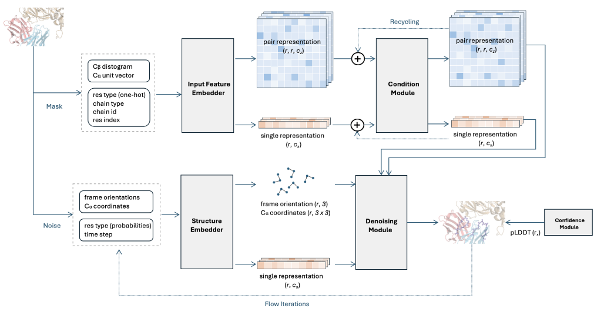

# AbFlow



Redesign antibody CDR loops with SE(3) flow matching

(paper) (demo)

## Install

```bash
conda env create -f env.yaml -n abflow
conda activate abflow
```

## Datasets and Trained Weights

Trained model weights are available at (huggingface)

## Redesign Antibody-Antigen Complex

4 design modes are available. Each mode corresponds to a config file in the `configs/test` folder:

| Config File                   | Description                                                   |
| ------------------------------| ------------------------------------------------------------  |
| `codesign_single.yml`         | Sample both the **sequence** and **backbone** of **one** CDR. |
| `predict_sequence_single.yml` | Sample only the **sequence** of **one** CDR (fix-backbone sequence design). |
| `predict_backbone_single.yml` | Sample only the **backbone** of **one** CDR (structure prediction). |
| `codesign_multicdrs.yml`      | Sample both the **sequence** and **backbone** of **all** the CDRs simultaneously. |

Below is the usage of `design_pdb.py`. It samples CDRs for antibody-antigen complexes. The full list of options can be found in [`abflow/tools/runner/design_for_pdb.py`](abflow/tools/runner/design_for_pdb.py).

```bash
python design_pdb.py \
	<path-to-pdb> \
	--heavy <heavy-chain-id> \
	--light <light-chain-id> \
	--config <path-to-config-file>
```

The `--heavy` and  `--light` options can be omitted as the script can automatically identify them with AbNumber and ANARCI.

The below example designs the six CDRs separately for the `7DK2_AB_C` antibody-antigen complex.

```bash
python design_pdb.py ./data/examples/7DK2_AB_C.pdb \
	--config ./config/test/codesign_single.yml
```

## Train

```bash
python train.py ./configs/train/<config-file-name>
```

## Contact

Please contact hz362@cam.ac.uk to report any issues.

## Reference